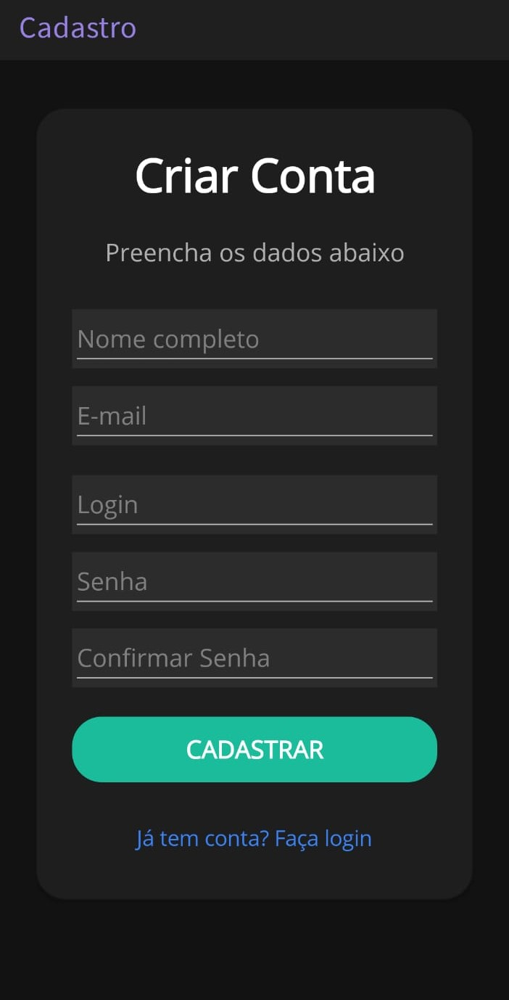
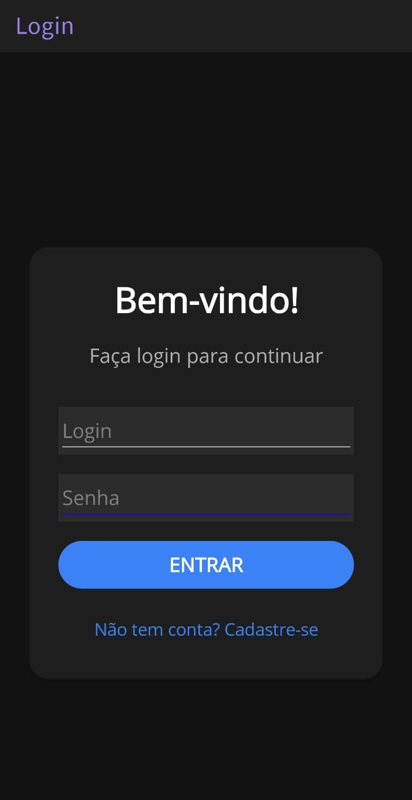

# AppCompleta - Cadastro e Login com .NET MAUI


## Descrição


Aplicativo mobile desenvolvido em .NET MAUI que realiza o cadastro e autenticação de usuários consumindo uma API REST ASP.NET Core por meio de requisições HTTP. Após a autenticação, o usuário é direcionado para uma tela de boas-vindas Os dados são armazenados em um banco de dados MySQL.

O projeto foi desenvolvido com foco em aprender a integração entre aplicações mobile, APIs REST e bancos de dados externos.


## Tecnologias Utilizadas


- .NET MAUI
- C#
- ASP.NET Core Web API
- MySQL
- SHA-256
- Visual Studio 2022

## Funcionalidades

- Cadastro de usuários
- Login com autenticação
- Criptografia de senhas utilizando SHA-256
- Validação dos dados informados
- Comunicação entre aplicativo e API REST utilizando requisições HTTP
- Tela de boas-vindas personalizada
- Armazenamento dos dados em banco de dados MySQL


## Arquitetura

O projeto está organizado em dois projetos independentes:

- **AppCompleta/** → Aplicativo desenvolvido em .NET MAUI
- **AppCompletaAPI/** → API ASP.NET Core responsável pelo cadastro, autenticação e comunicação com o banco de dados

Fluxo da aplicação:

```
Aplicativo .NET MAUI
        │
        │ HTTP (JSON)
        ▼
ASP.NET Core Web API
        │
        │ MySql.Data
        ▼
Banco de Dados MySQL
```


## Meu Aprendizado

Este projeto foi inicialmente desenvolvido utilizando SQLite como banco de dados local. Posteriormente, adaptei toda a aplicação para utilizar um banco de dados MySQL por meio de uma API ASP.NET Core.

Durante esse processo pratiquei conceitos como:

- consumo de APIs REST;
- criação de endpoints;
- comunicação cliente-servidor;
- integração entre aplicação mobile e API;
- conexão com banco de dados MySQL;
- autenticação de usuários;
- organização de projetos em camadas.

Este foi meu primeiro projeto integrando uma aplicação .NET MAUI a uma API e a um banco de dados externo.


## Banco de Dados

O script para criação do banco de dados encontra-se na pasta:

```
database/appcompleta.sql
```

Após importar o script, configure a string de conexão no arquivo:

```
AppCompletaAPI/appsettings.json
```

## Requisitos

- Visual Studio 2022 ou superior
- .NET 8
- MySQL ou MariaDB
- XAMPP, WAMP, Laragon ou outro servidor local
- Android Emulator ou dispositivo Android
- Navegador web

## Instalação

1. Clone este repositório.
2. Importe o script localizado em `database/appcompleta.sql`.
3. Configure a string de conexão da API em `AppCompletaAPI/appsettings.json`.
4. Inicie o servidor MySQL.
5. Execute a API ASP.NET Core.
6. Execute o aplicativo .NET MAUI.
7. Realize um cadastro e faça login.

## Imagens do Sistema

### Tela de Cadastro


### Tela de Login


### Tela de Boas Vindas


## Próximas Melhorias

- Recuperação de senha
- Validação de e-mail
- Token JWT
- Persistência do login
- Logout
- Melhor tratamento de erros
- Hospedagem da API na nuvem


## Observação


Este projeto possui fins de estudo e demonstração.

Todos os dados são fictícios.

Para executar o aplicativo em um dispositivo Android físico durante o desenvolvimento, é necessário alterar a URL da API para o endereço IP da máquina onde a API estiver sendo executada.


## Autora


- Maria Fernanda Marques Rodrigues
